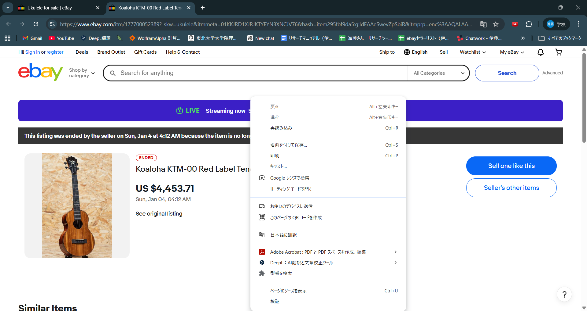
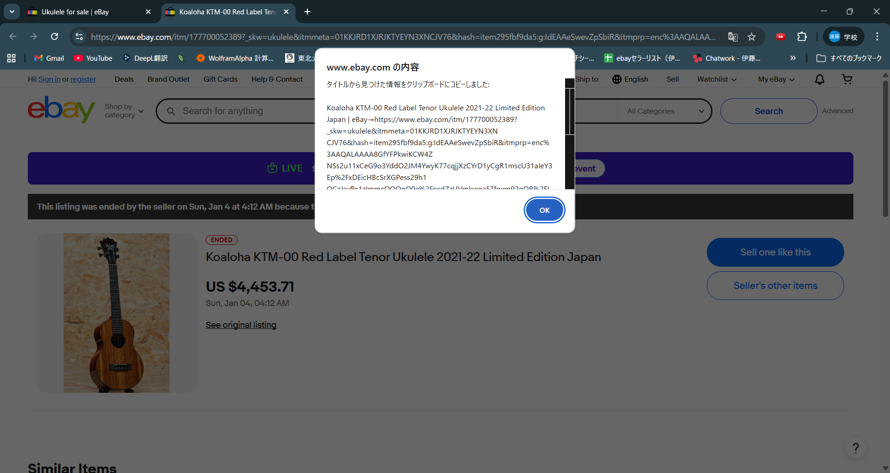
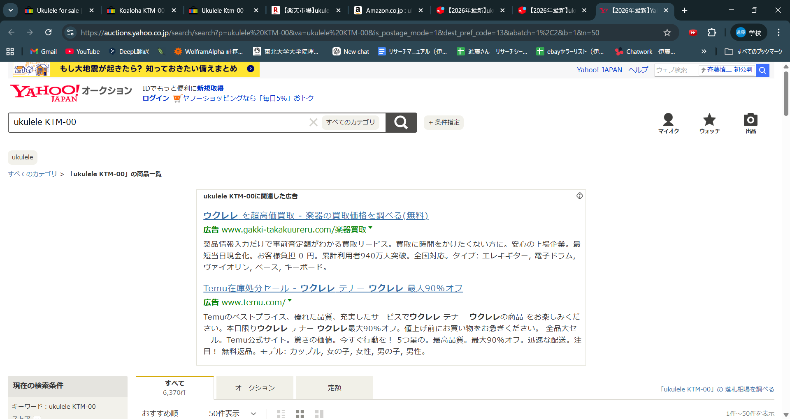

# Price Search Chrome Extension

eBayの商品ページからウクレレの型番を抽出し、楽天・Amazon・メルカリ・ヤフオクで同時検索できるChrome拡張です。

## 機能

- 商品タイトルから型番を抽出
- 楽天で検索
- Amazonで検索
- メルカリで検索
- ヤフオクで検索
- eBayの中古検索

右クリックメニューから実行できます。

## 開発背景

ウクレレの中古価格を調べる際に、
複数のECサイトで毎回検索するのが手間だったため、
検索作業を自動化する目的で作成しました。

## 使用技術

- JavaScript
- Chrome Extension API
- Chrome Storage API

## 使い方

1. Chromeに拡張機能を読み込む
2. eBayの商品ページを開く
3. 右クリック
4. 型番検索メニューをクリック

すると複数サイトの検索結果が自動で開きます。

## カスタム検索機能

オプション画面から型番検索時に追加するワードを変更できます。

例
- ukulele（デフォルト設定）
- Yamaha
- Mizuno

商品に合わせて検索条件を変えられるので、型番のみの検索よりも精度を上げることが出来ます。

## スクリーンショット

### 右クリックメニュー

### 商品タイトルなどのコピー

### 検索結果

### オプション画面

